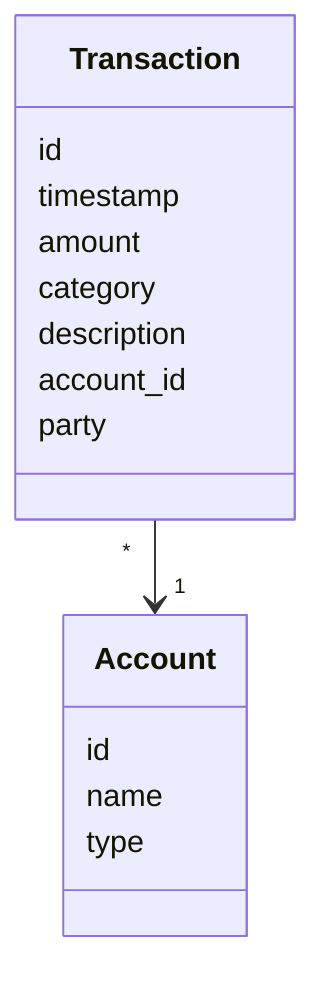

# Architecture

## Entities

The application uses the following entities. An `account` can be anything from a bank account, to crypto currency or a loan. A `transaction` contains information about a single transaction where money is moved from one account to another, for example when receiving the monthly salary from the employer or making a purchase at the grocery store. Each account can be connected to multiple transactions and a single transaction can be only connected to one account.

