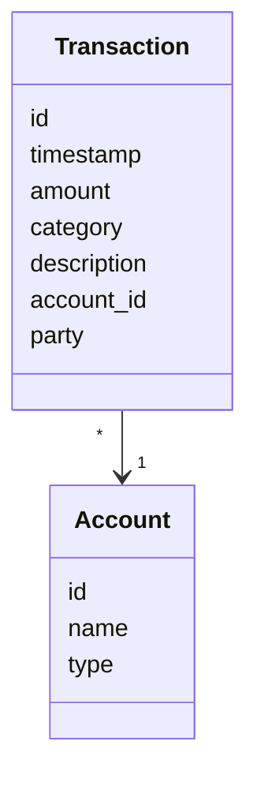

# Architecture

```mermaid
classDiagram
    Transaction "*" --> "1" Account
    class Account {
        id
        name
        type
    }
    class Transaction {
        id
        timestamp
        amount
        category
        description
        account_id
        party
    }
```
