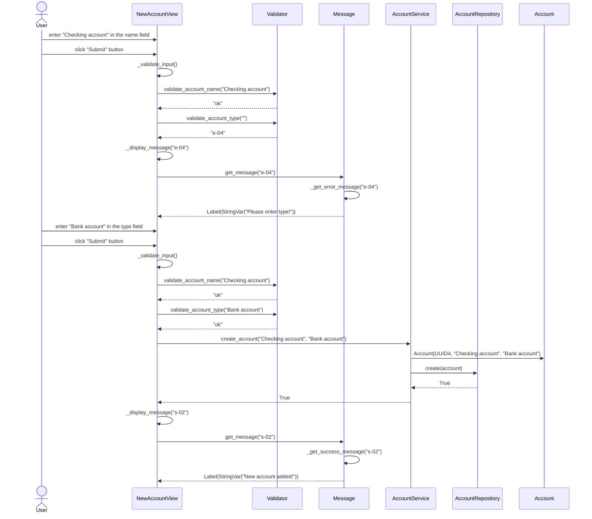
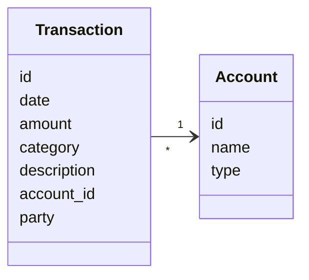

# Architecture

## Project structure

The application is divided into three main parts. The package `ui` contains all user interface elements. User interface makes calls to the package `services`, which uses `repositories` and other functions (such as file_handler.py) to handle data. Both services and repositories take advantage of `entities` to pass information about relevant data in an object form.

## User interface

The application has a graphical user interface created with the `tkinter` module. The user interface consists of six relevant views that form a hierarchical structure. Only one view can be viewed at a time and each view contains buttons for moving back to the previous view or possibly other views.

- Main view
  - Account view
    - New account view
  - Transaction view
    - New transaction view
  - Settings view

## Functionality

### Creating a new account

The diagram below depicts a scenario in which a user creates a new account in the NewAccountView. First the user tries to create a new account, but hasn't specified its type. The user then sees an error message and enters the missing parameter. A new account is created by calling the create_account() function of the account service. The function creates a new instance of the class Account with the parameters it was given, and creates a new UUID to be used as the primary key and a unique identifier in the database. The account service then passes the Account object to the account repository, which then creates a new account in the database and returns True. Finally, a message is displayed to the user indicating that a new account was succesfully created.



## Entities

The application uses the following entities. An `account` can be anything from a bank account, to crypto currency or a loan. A `transaction` contains information about a single transaction where money is moved from one account to another, for example when receiving the monthly salary from the employer or making a purchase at the grocery store. Each account can be connected to multiple transactions and a single transaction can be only connected to one account.



## Database

Data is stored in an `SQLite` database using the `sqlite3` module for Python. The database consists of two tables that correspond to the two entities used in the application. The following schema can be used to initialize the database.

```sql
CREATE TABLE accounts (
    id TEXT PRIMARY KEY,
    name TEXT,
    type TEXT
);

CREATE TABLE transactions (
    id TEXT PRIMARY KEY,
    date TEXT,
    amount INTEGER,
    category TEXT,
    description TEXT,
    account_id TEXT REFERENCES accounts,
    party TEXT
);
```
