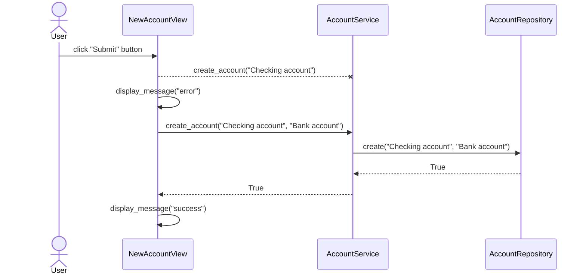

# Architecture

## Functionality

### Creating a new account

The diagram below depicts a scenario in which a user creates a new account in the NewAccountView. First the user tries to create a new account, but hasn't specified its type. The user then sees an error message and enters the missing parameter. A new account is created by calling the create_account() function of the account service. The function passes its parameters to the class AccountRepository, which then creates a new account in the database and returns True. Finally, a message is displayed to the user indicating that a new account was succesfully created.

## Entities

The application uses the following entities. An `account` can be anything from a bank account, to crypto currency or a loan. A `transaction` contains information about a single transaction where money is moved from one account to another, for example when receiving the monthly salary from the employer or making a purchase at the grocery store. Each account can be connected to multiple transactions and a single transaction can be only connected to one account.

