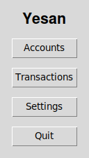
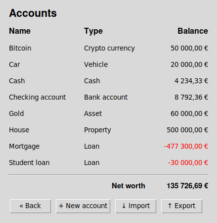
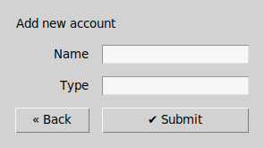
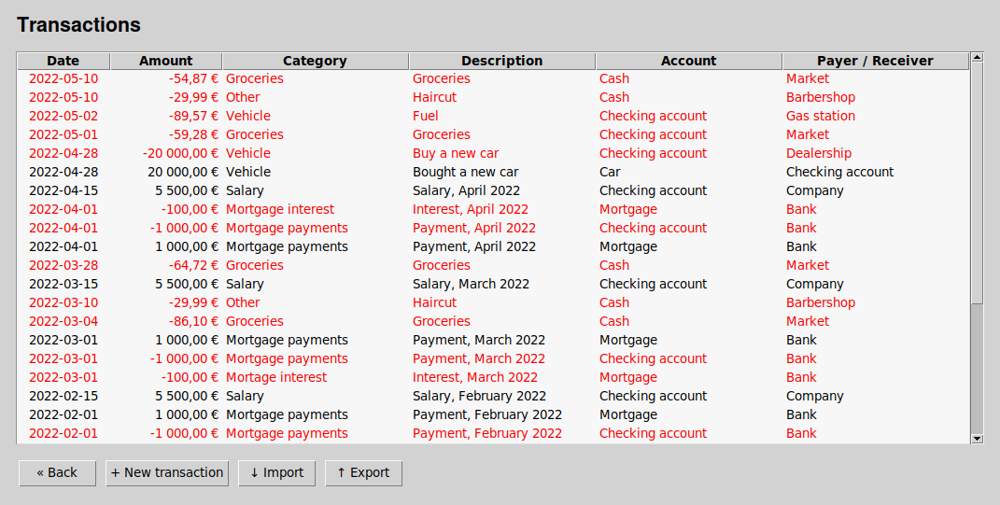
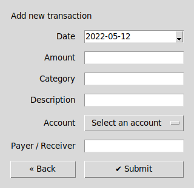
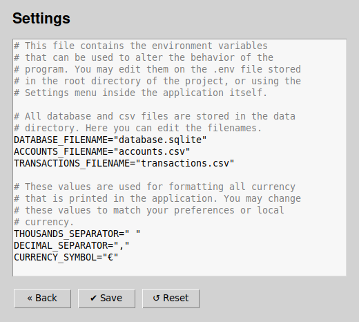

# User manual

## Installing

The application can be installed by running the following commands.

```bash
# Get the source code
$ git clone git@github.com:rikurauhala/yesan.git

# Change directory
$ cd yesan

# Install dependencies
$ poetry install

# Initialize the database
$ poetry run invoke build
```

### Troubleshooting

There are alternative ways to get the source code. You may also download the source code as a zip file from the repository main page or by getting the latest [release](https://github.com/rikurauhala/yesan/releases/).

```bash
# Get the source code over HTTPS
$ git clone https://github.com/rikurauhala/yesan.git

# Get the source code with GitHub cli
$ gh repo clone rikurauhala/yesan
```

## Running

The application can be started by running the start command. Make sure that the database has been initialized first!

```bash
# Run the application
$ poetry run invoke start
```

## Configuration

The behavior of the application can be configured by changing the values contained in the .env file in the root directory of the project. Alternatively, changes can be made inside the program itself by entering the settings view and editing the values there. Default values are also stored in the .env.default file in case the user happens to rewrite the file in an unexpected way.

```bash
# This file contains the environment variables
# that can be used to alter the behavior of the 
# program. You may edit them on the .env file stored
# in the root directory of the project, or using the
# Settings menu inside the application itself.

# All database and csv files are stored in the data
# directory. Here you can edit the filenames.
DATABASE_FILENAME="database.sqlite"
ACCOUNTS_FILENAME="accounts.csv"
TRANSACTIONS_FILENAME="transactions.csv"

# These values are used for formatting all currency
# that is printed in the application. You may change
# these values to match your preferences or local
# currency.
THOUSANDS_SEPARATOR=" "
DECIMAL_SEPARATOR=","
CURRENCY_SYMBOL="€"
```

## User interface

This section contains screenshots of the application, captured on a machine running Cubbli Linux with the i3 window manager. Please note, that the application may look different depending on the operating system.

### Main view



The main view consists of four buttons. Clicking the `Accounts` button will display the Account view and clicking the `Transactions` button will take you to the Transaction view. The `Settings` button will display the Settings view that allows user to edit the configuration file of the application. Pressing the `Quit` button will ask for confirmation to terminate the program.

### Account view



When you first run the application, the account view should be empty. After adding accounts and transactions the view will start to make more sense. The account view offers a clear picture of your net worth and current status of all your accounts, assets, loans and so on. To add your first account, click the `+ New account` button.

The account view also offers functionality for exporting from and exporting the account data into a .csv file. This can be particularly useful if the user wishes to use the application on a different machine. It also makes creating back-ups easy as the file can just be copied to another location.

Click the `↑ Export` button to export the account data into a file. The file will be located in the data directory. You can change the file name in the configuration file .env, or by going to the Settings view.

Click the `↓ Import` button to import data from the file.

### New account view



To add a new account, fill in the fields for the name and the type of the account. Then click `✔ Submit`. You may add more accounts or go back to the account view by pressing the `« Back` button.

### Transaction view



The transaction view consists of more data than the account view. All your transactions will show up here. Latest transactions will always show up at the top. Red color indicates a negative transaction, as in money being sent away from you.

### New transaction view



This view works just like the new account view, but more information is required. To add a new transaction, you first need to have at least one account added. If you try to add invalid data, the application should display a helpful message in red.

### Settings view



The settings view contains the contents of the .env file in an editable text widget. You may edit the contents of the file either inside this view, or by opening the file itself with your favorite text editor. Pressing the `✔ Save` button will write all changes to the .env file. Please do not edit the rows that start with the # symbol! Those are just helpful comments with no actual functionality! If you made a mistake, you can always hit the `↺ Reset` button to start over with the default settings.
