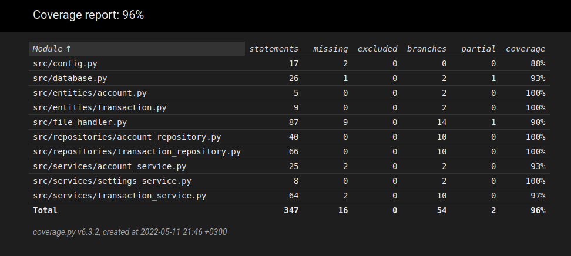

# Testing

## Unit testing and integration testing

The application can be tested automatically by running the command `poetry run invoke test`. Unit testing and integration testing have been created with the `pytest` framework. Test related files are located in the src/tests directory.

Automated tests utilise the pytest library and test most of the programs functionality.

### Coverage report

Most of the source code is covered by automated tests. User interface (directory src/ui) is omitted from the test coverage as it is not tested automatically in the first place. A coverage report can be generated by running the command `poetry run invoke coverage-report`. The report files are stored in the htmlcov directory. The test coverage report can be viewed by opening the file htmlcov/index.hmtl in the web browser.

## System testing

System testing of the application has been conducted manually, as it has a graphical user interface. The application was tested on a machine running the Cubbli Linux operating system. Installation was done following the instructions found in the user manual. Everything worked as expected and the application did not crash.

Several different configurations were tested by editing the .env file.

Different inputs were tried to be inserted in the new account view and the new transaction view. Doing this also helped in the development process as it made more clear how input validation should work and what kind of input should be allowed.

## Known issues

- After importing accounts or transactions, the view does not refresh automatically. The user has to go to another view and go back to see the changes.
- It may not be evident enough if the user has forgotten to run the build command to initialize database. The application should not crash but it only reminds the user after they are trying to add a new accounts and see the error message.
